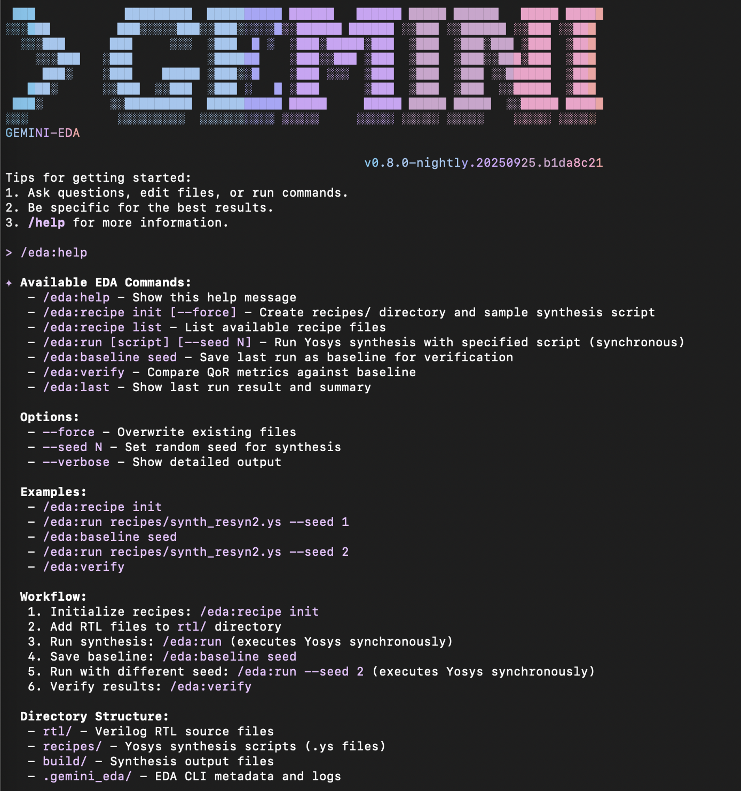

# EDA Synthesis Tools

The EDA CLI extension provides specialized tools for hardware design synthesis workflows, enabling deterministic synthesis runs with Quality of Results (QoR) verification.

## Overview

The EDA synthesis tools integrate with Yosys to provide:

- Deterministic synthesis with seed support
- QoR metrics comparison against baselines
- Recipe-based synthesis script management
- Local-only operation for reproducible results



*Screenshot showing the `/eda:help` command output with all available EDA synthesis commands*

## Available Commands

### `/eda:help`
Show available EDA commands and usage information.

### `/eda:recipe:init [--force]`
Create a recipes directory and sample synthesis script.

### `/eda:recipe:list`
List all available recipe files in the recipes directory.

### `/eda:run [script] [--seed N]`
Run Yosys synthesis with the specified script and optional seed.

### `/eda:baseline:seed`
Save the last synthesis run as a baseline for QoR verification.

### `/eda:verify`
Compare current synthesis results against the saved baseline.

### `/eda:last`
Display the results and summary of the last synthesis run.

## Requirements

- Node.js 20+
- Yosys installed and available on PATH
- Project structure with `rtl/` and `recipes/` directories

## Installation

```bash
npm install -g @google/gemini-cli-eda
```

## Usage Examples

### Using EDA CLI Directly
```bash
# Start EDA CLI
gemini-eda-v0_1

# Inside the EDA REPL
gemini-eda › /eda:help
gemini-eda › /eda:recipe:init
gemini-eda › /eda:run recipes/synth_resyn2.ys --seed 1
gemini-eda › /eda:baseline:seed
gemini-eda › /eda:verify
```

### Using EDA Commands in Regular Gemini CLI
```bash
# Start regular Gemini CLI
gemini

# Use EDA commands
> /eda:help
> /eda:recipe:init
> /eda:run recipes/synth_resyn2.ys --seed 1
```

## Workflow

1. **Initialize**: Run `/eda:recipe:init` to create the recipes directory
2. **Synthesize**: Run `/eda:run` to perform synthesis with your RTL
3. **Baseline**: Run `/eda:baseline:seed` to save results as baseline
4. **Compare**: Run `/eda:verify` to compare new runs against baseline
5. **Review**: Use `/eda:last` to see the latest synthesis results

## QoR Verification

The EDA CLI provides built-in Quality of Results (QoR) verification:
- **Cells**: Number of logic cells used
- **Levels**: Logic depth of the design
- **Area**: Physical area (when available)
- **Warnings**: Synthesis warnings count

Verification rules:
- Accept if `levels_now ≤ levels_baseline` AND `cells_now ≤ cells_baseline`
- Reject if either metric increases

## See Also

- [EDA CLI Package Documentation](../../packages/eda-cli/README.md)
- [Test Guide](../../TEST_GUIDE.md) - Comprehensive testing instructions
- [Yosys Documentation](https://yosyshq.net/yosys/) - Yosys synthesis tool
