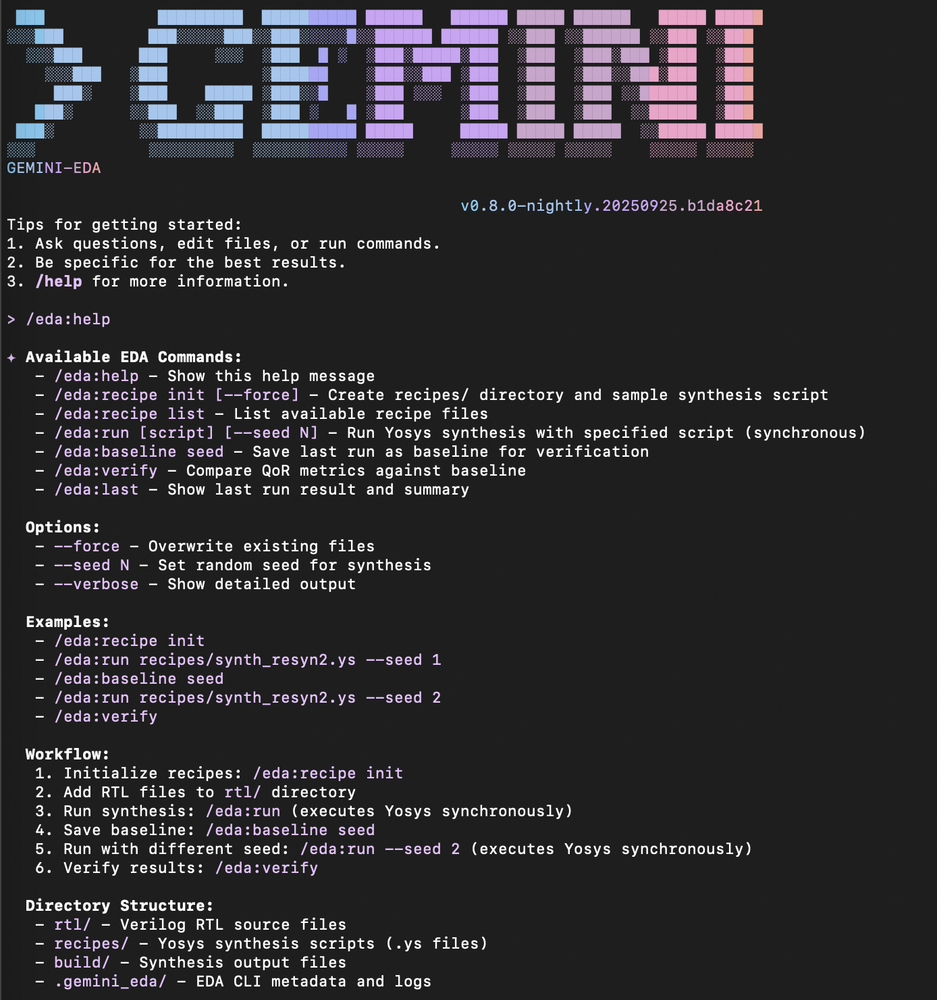

# Gemini EDA CLI

A specialized REPL mode for hardware synthesis within the Gemini CLI ecosystem.

## Overview

The Gemini EDA CLI provides a thin, local-only wrapper around Yosys to enable deterministic synthesis runs with QoR (Quality of Results) verification. It's designed as an extension to the main Gemini CLI, activated via a sub-command.



*Screenshot showing the `/eda:help` command output with all available EDA synthesis commands*

## Features

- **Yosys Integration**: Direct integration with Yosys synthesis tool
- **QoR Verification**: Built-in metrics comparison against baselines
- **Recipe Management**: Template-based synthesis script management
- **Deterministic Runs**: Reproducible synthesis with seed support
- **Local-Only**: No LLM calls in MVP, ensuring deterministic results

## Installation

### Global Installation

```bash
npm install -g @google/gemini-cli-eda
```

### Local Development

```bash
cd packages/eda-cli
npm install
npm run build
```

## Usage

### Direct Execution

```bash
# Run the EDA CLI directly
gemini-eda-v0_1
```

### Commands

- `/eda:help` - Show available commands
- `/eda:recipe:init` - Create recipes directory and sample script
- `/eda:recipe:list` - List available recipe files
- `/eda:run [script] [--seed N]` - Run Yosys synthesis
- `/eda:baseline:seed` - Save last run as baseline
- `/eda:verify` - Compare QoR against baseline
- `/eda:last` - Show last run results

### Example Workflow

```bash
# Start EDA CLI
gemini-eda-v0_1

# Inside the EDA REPL
gemini-eda › /eda:recipe:init
gemini-eda › /eda:run recipes/synth_resyn2.ys --seed 1
gemini-eda › /eda:baseline:seed
gemini-eda › /eda:run recipes/synth_resyn2.ys --seed 2
gemini-eda › /eda:verify
```

## Architecture

The package is structured as a modular extension to the main Gemini CLI:

- **Types**: Core data structures and interfaces
- **Parser**: Yosys output parsing and metrics extraction
- **Validation**: Directory structure and file validation
- **Commands**: EDA command implementations
- **Integration**: Main CLI integration and REPL mode

## Requirements

- Node.js 20+
- Yosys installed and available on PATH
- Project structure with `rtl/` and `recipes/` directories

## Development

This package is part of the Gemini CLI monorepo and follows the same development patterns and standards.
